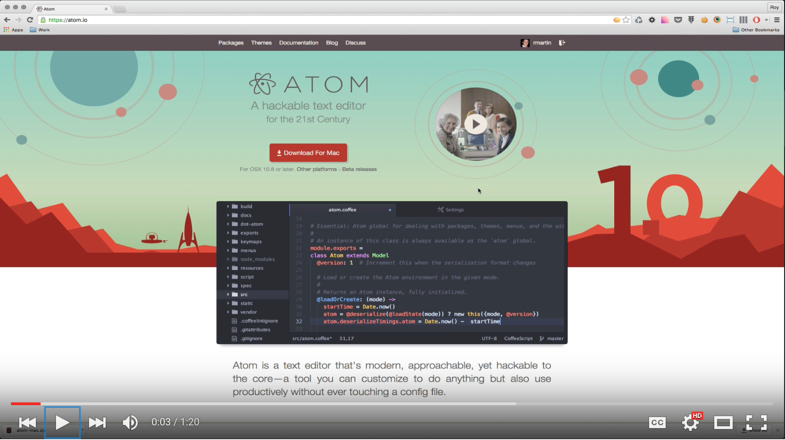

#### [⇐ Previous](04_slack.md) | [Next ⇒](06_html_css.md)

## Atom

**Duration:** About 1 hour

[Atom][atom] is a text editor from GitHub that's modern, approachable, yet hackable to the core. It's quickly becoming the text editor of choice for many full stack developers because it's easy to use, provides syntax highlighting and tab completions, and can be customized to do anything without ever touching a config file.

In this chapter, your objective is to demonstrate competency with Atom. To complete this objective, please follow along with the videos found below and complete the self-assessment at the end of this chapter. If you're already familiar with Atom, you may be able to complete the self-assessment without watching the video. Though, you may also learn a trick or two from it.

If you've ordered a laptop through us, please coordinate with your campus on the earliest date it's available for pickup. Also, you may want to re-watch this once you obtain it.

[Learn the Atom Editor][learn-atom]

[][learn-atom]

### Self-assessment

Take a moment to think about how you would answer the following questions. Then write down the questions and your answers in a notebook. When you're done, check your answers against our [solutions](solutions/05_atom.md) and see how you faired.

#### Installing Atom

- How do you install the Atom application?
- How do you install Atom's shell commands?

#### Configuring Atom

- How do you open Atom's preferences?
- What are core settings?
- What's the keybinding for the `find-and-replace:show` command?
- Where can you find hints for some of the keybindings?
- What's the command palette?
- What are Atom packages?
- What's a community package?
- What's a core package?
- Where can you find additional settings for a package?
- How can you install a community package?
- What's a UI theme?
- What's a Syntax theme?
- How do you download and install an update for Atom and its core packages?
- How do you download and install an update for community packages?

#### Using Atom

- How do you open a file in Atom?
- How do you open a folder in Atom?
- How do you create a new file in Atom?
- How do you change the language grammar of a file?
- How does Atom automatically detect the language grammar of a file?
- What's the keyboard shortcut to jump to a line number?
- What's the keyboard shortcut for listing a file's symbols?
- What's the keyboard shortcut to jump to an open or close bracket?
- What's the keyboard shortcut for selecting each occurrence of a word?
- What's the keyboard shortcut for selecting all occurrences of a word?
- What's the keyboard shortcut for going back to a single cursor?
- What's the keyboard shortcut for opening the "Find and Replace" pane?
- What's the keyboard shortcut for opening the "Find and Replace in Project" pane?
- What's a snippet?
- What does the `log` + `Tab` snippet do in the JavaScript language grammar?
- What does the `html` + `Tab` snippet do in the HTML language grammar?

### Conclusion

Congratulations! By completing the self-assessment, you've demonstrated a high degree of discipline and competency with Atom. You're now ready to build a website.

#### [⇐ Previous](04_slack.md) | [Next ⇒](06_html_css.md)

[atom]: https://atom.io/
[learn-atom]: https://www.youtube.com/watch?v=ErpALj-8l5M&list=PLl4aJLa4PetCQcCEL0FvCh3L1SVf-nNSU
