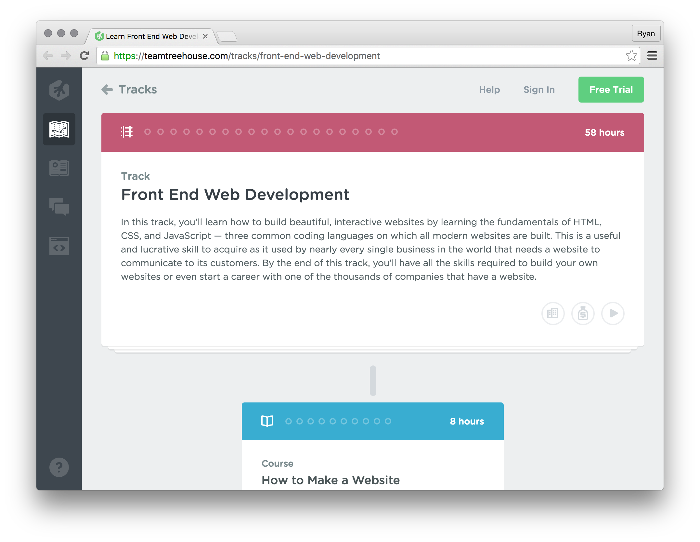

# Bonus: HTML & CSS

Similar to JavaScript, you'll be using HTML and CSS throughout the in-person training. If you're feeling a little weak in these areas, we strongly recommend you get some more practice before the program starts. **Treehouse** has an excellent course on front end web technologies that's worth checking out.

[Treehouse - Front End Web Development][treehouse]

[][treehouse]

[treehouse]: https://teamtreehouse.com/tracks/front-end-web-development
