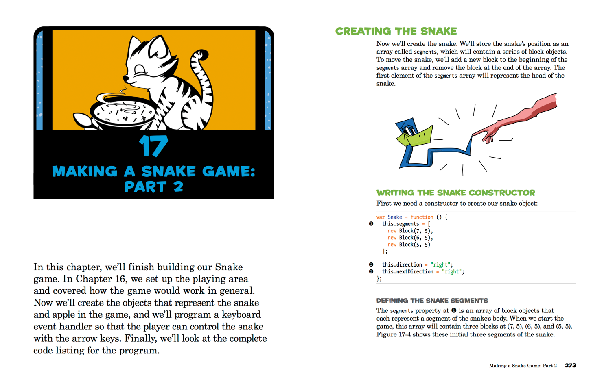

# Bonus: JavaScript

If there's one thread that binds the entire in-person training together it's JavaScript. Students who enter the program strong in JavaScript are often the ones leaving with a job right out of the gate. That's why we highly encourage you to finish the **JavaScript for Kids** book. The remaining chapters will teach you how to build fun, 2-D games for the browser from scratch. For the uninitiated, games are by far the most sophisticated type of application you can build. Plus, students often like to make a browser-based game for their first quarter project. And with a few under your belt, you'll definitely have an easier time thinking up and executing on an game idea, if that's the route you decide to take.

[JavaScript for Kids][javascript-kids]

[][javascript-kids]

[javascript-kids]: https://www.nostarch.com/jsforkids
