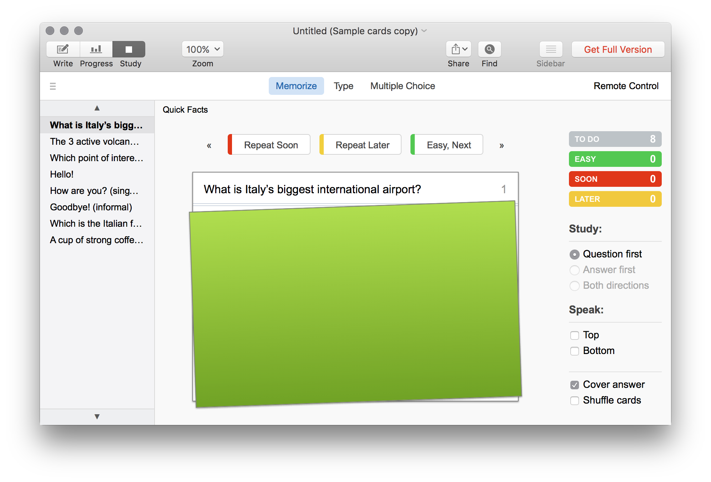

# Bonus: Studying & Learning

Flashcards are an effective learning drill that aids in the memorization of new concepts. If you like the idea of making flashcards but don't want to carry them around, **Flashcard Hero** is a free flashcard app for macOS and iOS. It supports building cards with both text and images, grouping cards by topics, testing your memory with the [Leitner system][leitner-system] of spaced repetition, and generating progress reports on how well you remember each card.

[Flashcard Hero][flashcard-hero]

[][flashcard-hero]

[flashcard-hero]: https://itunes.apple.com/us/app/flashcard-hero-free/id726165621?mt=12
[leitner-system]: https://en.wikipedia.org/wiki/Leitner_system
