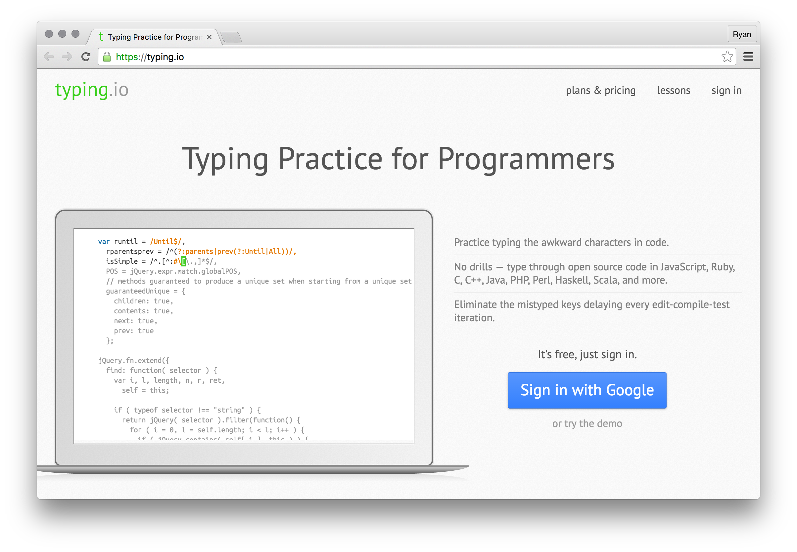

# Bonus: Typing

Quickly typing common English words is an important skill, but so is typing awkward programming characters. **typing.io** is a typing speed test for developers that'll help you learn how to type these character faster. Take this test a few times and see if you can score faster than 30 words per minute.

[typing.io][typing_io]

[][typing_io]

[typing_io]: https://typing.io/

#### Keyboard shortcuts

There are tons of keyboard of shortcuts to learn. For that, look into **shortcutFoo**. Most of their modules require payment, but there are a few free lessons for developer tools like Atom.

[shortcutFoo][shortcutFoo]

[][shortcutFoo]

[shortcutFoo]: https://www.shortcutfoo.com/
