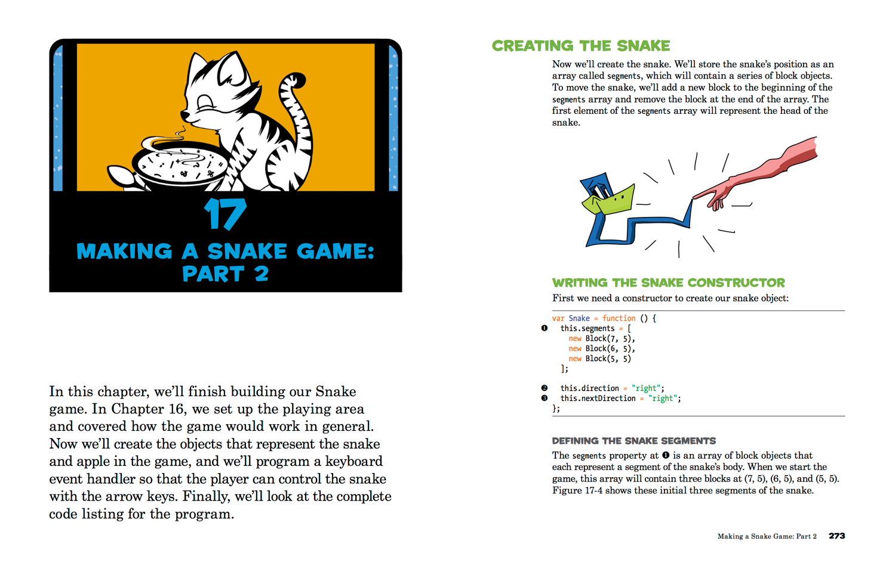
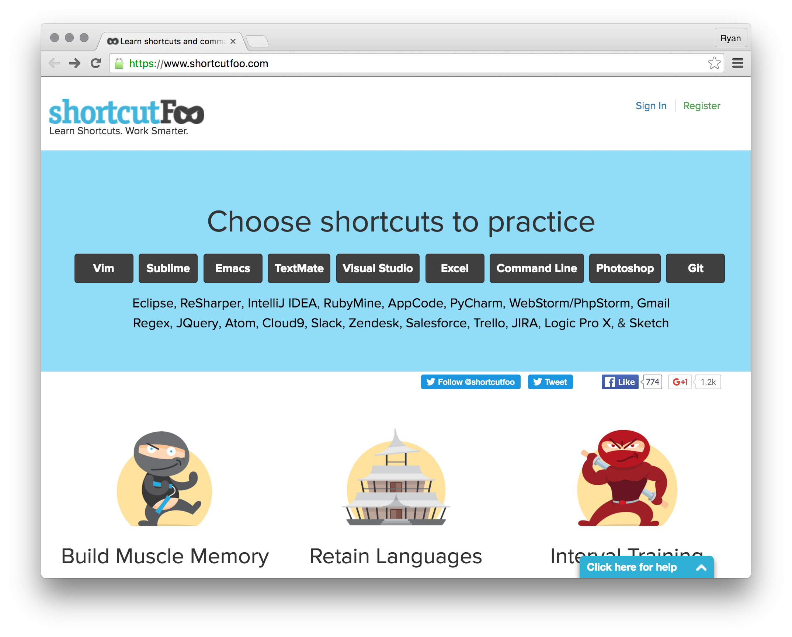

#### [⇐ Previous](studying_learning.md) | [README ⇒](README.md)

## Bonus

**Duration:** Unlimited

Congratulations on finishing the essential chapters of the precourse! If you're reading this, then you're probably wondering what you can do to hit the ground running, especially for the first month of the in-person training. Well, you came to the right place as we're serious about supporting your ambitious goals. However, we're also serious about helping you maximize the entire 6 months of your training. So before continuing with the bonus topics below, we strongly recommend that you consider taking steps to improve your overall wellness.

#### Spend time relaxing

You'll have plenty of time to be stressed once the in-person training begins. Now's a great time to take care of your mind and body, so when class starts, you'll feel refreshed and ready to learn.

- Take a nap in the sun.
- Visit your family and friends.
- Catch up on your favorite shows.
- Read that book you've been putting off.
- Go on an adventure.

#### Build good habits

It takes most people a few weeks to solidify new habits. Now's a great time to start or continue good habits, so when class starts, you'll feel healthy and strong.

- Wake up (and go to bed) early.
- Make healthy lunches for yourself.
- Add exercise and/or meditation to your daily routine.
- Think (and say aloud) positive thoughts about yourself.
- Cut back on any vices like caffeine, alcohol, nicotine, or marijuana.

## Topics

Here are our suggestions on how to further level-up your developer chops before the in-person training gets rolling.

#### Studying & Learning

Flashcards are an effective learning drill that aids in the memorization of new concepts. If you like the idea of making flashcards but don't want to carry them around, **Flashcard Hero** is a free flashcard app for macOS and iOS. It supports building cards with both text and images, grouping cards by topics, testing your memory with the [Leitner system][leitner-system] of spaced repetition, and generating progress reports on how well you remember each card.

[Flashcard Hero][flashcard-hero]

[][flashcard-hero]

[flashcard-hero]: https://itunes.apple.com/us/app/flashcard-hero-free/id726165621?mt=12
[leitner-system]: https://en.wikipedia.org/wiki/Leitner_system

#### JavaScript

If there's one thread that binds the entire in-person training together it's JavaScript. Students who enter the program strong in JavaScript are often the ones leaving with a job right out of the gate. That's why we highly encourage you to finish the **JavaScript for Kids** book. The remaining chapters will teach you how to build fun, 2-D games for the browser from scratch. For the uninitiated, games are by far the most sophisticated type of application you can build. Plus, students often like to make a browser-based game for their first quarter project. And with a few under your belt, you'll definitely have an easier time thinking up and executing on an game idea, if that's the route you decide to take.

[JavaScript for Kids][javascript-kids]

[][javascript-kids]

[javascript-kids]: https://www.nostarch.com/jsforkids

#### HTML & CSS

Similar to JavaScript, you'll be using HTML and CSS throughout the in-person training. If you're feeling a little weak in these areas, we strongly recommend you get some more practice before the program starts. **Treehouse** has an excellent course on front end web technologies that's worth checking out.

[Treehouse - Front End Web Development][treehouse]

[][treehouse]

[treehouse]: https://teamtreehouse.com/tracks/front-end-web-development

#### Typing

Quickly typing common English words is an important skill, but so is typing awkward programming characters. [typing.io][typing_io] is a typing speed test for developers that'll help you learn how to type these character faster. Take this test a few times and see if you can score faster than 30 words per minute.

[][typing_io]

[typing_io]: https://typing.io/

#### Keyboard shortcuts

There are tons of keyboard of shortcuts to learn. For that, look into **shortcutFoo**. Most of their modules require payment, but there are a few free lessons for developer tools like Atom.

[shortcutFoo][shortcutFoo]

[][shortcutFoo]

[shortcutFoo]: https://www.shortcutfoo.com/

#### [⇐ Previous](studying_learning.md) | [README ⇒](README.md)
