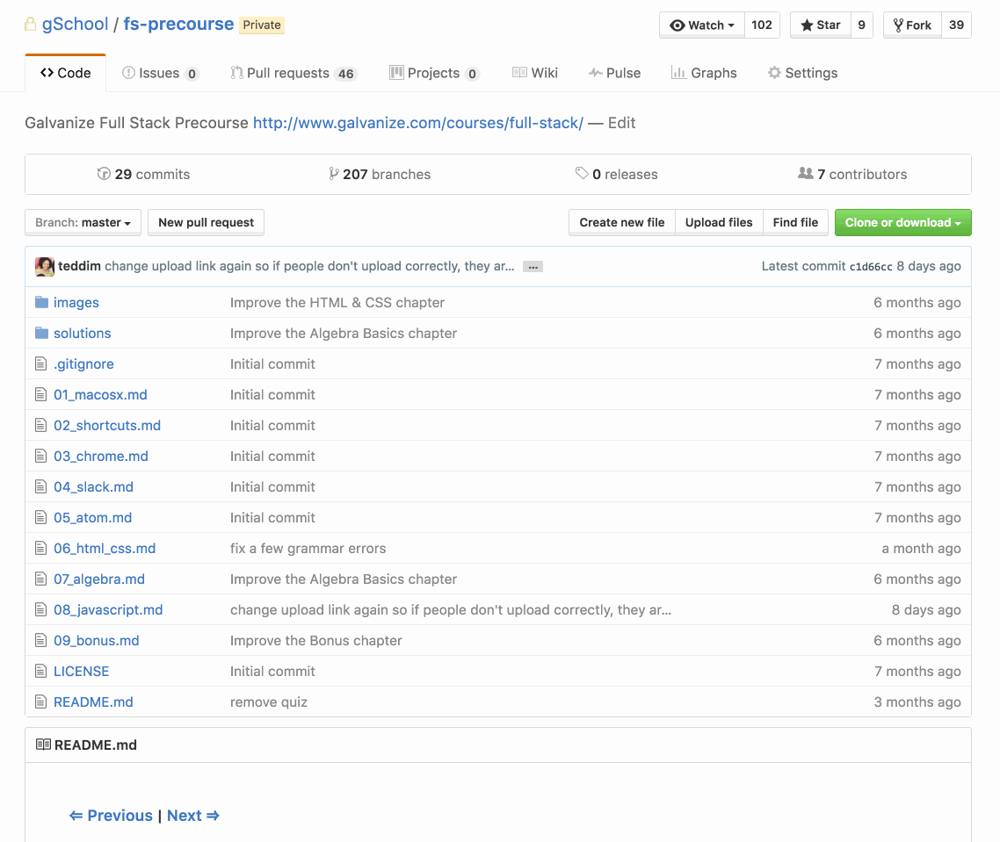

# HTML

**Duration:** About 7 hours

Hyper Text Markup Language, or **HTML**, is a language for describing the structure and content of a web page with syntax like `
Hello world
`. HTML is _the_ essential language for web development.

In this chapter, your objective is to demonstrate competency with HTML. To complete this objective, please follow along with the tutorial found below and complete the assessment at the end of this chapter. If you're already familiar with HTML, you may be able to complete the assessment without reading the tutorial. Though, you may also learn a trick or two from it.

As you read through the tutorial, type out every code sample by hand that you come across. Then try to run the code in a web browser like Google Chrome. Only copy-and-paste code as a last resort if you can't get it to work correctly.

## Objectives
1. [Use HTML to create a web-page](#markup)
2. [Use hyperlinks to reference HTML documents](#hyperlinks)
3. [Use rich media](#rich-media)
4. [Push your work to Github](#Push-to-Github)

### Markup
The structure of a web-page's content is a reflection of its HTML. If we want content to be presented as a list, we would use the `<li>` tag; if we want content to be presented in a table, we would then use the `<table>` tag. In other words, we can structure content how we want; we need, however, to use the correct tags.

To improve your familiarity with HTML, please read the following:

1. [Lesson 1: Building Your First Web Page][11]
2. [Lesson 8: Creating Lists][12]
3. [Lesson 11: Organizing Data with Tables][13]

When you're done reading through these lessons, you'll apply what you've learned to create the following HTML. (This is the HTML you would receive from IMDB if you searched for "Hackers".)

![Result Page for "Hackers" on IMDB][14]

Based off of this image, create a new html file that displays something similar to the above image.

### Hyperlinks
A hyperlink, which is created with an `<a>` tag, enables developers to link a web-page to another (or the same) web-page.

To learn how to use hyperlinks, please read [Creating Hyperlinks][21].

After you're done reading, we'll apply this new knowledge to the result's page we created. Please follow these instructions:

1. You will not create a separate page of HTML for each movie title on the result's page. We want, however, you to gain practice with hyperlinks. Please write the code to make each movie title a hyperlink. When the link is clicked, a new tab should open. Using a [relative][22] link, have the tab open to this README.md.

2. You will also not create a separate page of HTML for each actor or actress. To this extent, turn every actor and actress on your result's page into a hyperlink. Have each link be an absolute path the actor or actress' page on IMDB.

### Rich Media
HTML has the amazing ability to support different types of rich media:

- ``: image
- `<svg>`: vector image
- `<embed>`: embedded video
- `<video>`: native video
- `<canvas>`: graphics
- and more...

Let's get some practice using rich media with [Lesson 9: Adding Media][31]. After you're done with this lesson, include the `` tag into our result's page. Here's the instructions you should follow:

1. Replace each of the image placeholders (`[img placeholder]`) with an`` tag. You'll be provided [images][32] for each of the titles.

2. Set the height and width of each image to **32 x 44 pixels**.

### Push to Github

When you're finished, we'd like to take a look at your work. Please use the following steps to submit your website.

1. Go to https://github.com/gSchool/wdi-precourse-drills and click `Fork`.
	* You may need to click your username to create the `Fork` on your account.
	* `Forking` is a github concept that allows you to make an exact copy of a repository on your own account.

1. On your `Fork` of this repo on GitHub, (Make sure your name is in the top left of the page.) click the **Upload Files** button

1. Drag and drop the folder you'd like to upload.

1. Type a short commit message. (e.g. added imdb website)

1. Click the **Commit changes** button.
	* This will upload your files to your copy of the repo on github

1. After uploading, click **New pull request** (Make sure your name is in the top left of the page.)

1. On the pull request page, click **Create pull request** and then after the page loads, click  **Create pull request** again
	* This will allow the galvanize instructors to see your uploaded files

## Conclusion

Congratulations! By completing this section, you've demonstrated a high degree of discipline and familiarity with HTML. Take a moment to congratulate yourself for all of your hard work. :)

[learn-html-css]: http://learn.shayhowe.com/html-css/building-your-first-web-page/

[1]: #1-of-4-markup
[11]: http://learn.shayhowe.com/html-css/building-your-first-web-page/
[12]: http://learn.shayhowe.com/html-css/creating-lists/
[13]: http://learn.shayhowe.com/html-css/organizing-data-with-tables/
[14]: html-images/imdb_hackers_html.png
[15]: http://learn.shayhowe.com/html-css/getting-to-know-html/#creating-hyperlinks

[2]: #2-of-4-hyperlinks
[21]: http://learn.shayhowe.com/html-css/getting-to-know-html/#creating-hyperlinks
[22]: http://www.coffeecup.com/help/articles/absolute-vs-relative-pathslinks/

[3]: #3-of-4-rich-media
[31]: http://learn.shayhowe.com/html-css/adding-media/
[32]: html-images

[4]: $4-of-4-push-to-github
[41]: https://help.github.com/articles/fork-a-repo/
[42]: https://help.github.com/articles/using-pull-requests/
