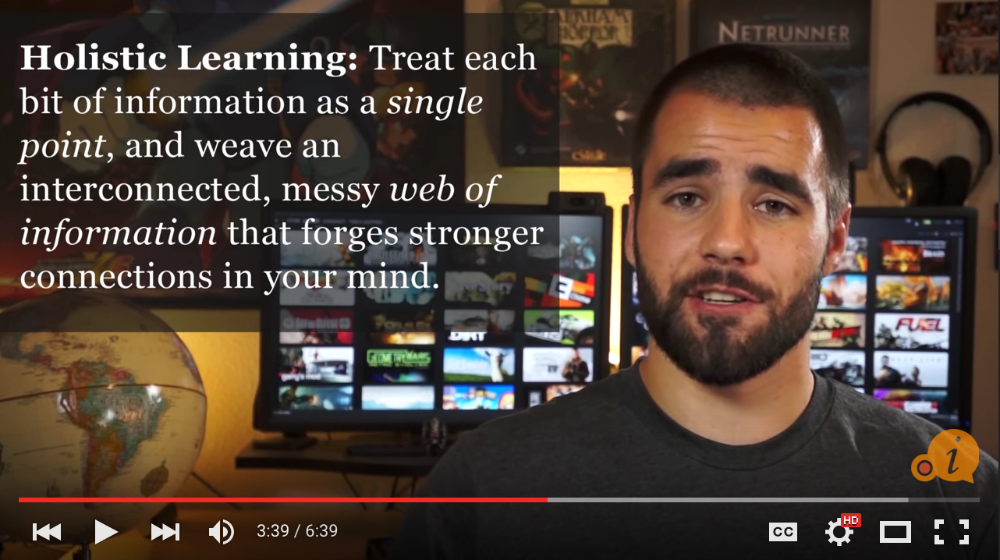

#### [⇐ README](README.md) | [Next ⇒](macos.md)

## Studying & Learning

**Duration:** About 2.5 hours

For many incoming students, their studying and learning techniques are a bit rusty. Maybe it's been a while since they've been in school or maybe they just never had anyone to show them good techniques. The **Effective Studying and Learning** video series will help you develop academic skills used by highly successful students. With some practice, your ability to retain and apply complex, web development concepts will drastically improve.

In this chapter, your objective is to demonstrate competency with studying and learning techniques. To complete this objective, please follow along with the videos found below and complete the self-assessment at the end of this chapter. If you're already familiar with studying and learning techniques, you may be able to complete the self-assessment without watching the videos. Though, you may also learn a trick or two from it.

[Effective Studying and Learning][studying-learning]

[][studying-learning]

[studying-learning]: https://www.youtube.com/watch?v=5ad6grll-ak&index=1&list=PLx65qkgCWNJIBzsXii5b6hze09et4cu5n

### Self-assessment

Take a moment to think about how you would answer the following questions. Then write down the questions and your answers in a notebook. When you're done, check your answers against our [solutions](solutions/studying_learning.md) and see how you fared.

#### How to Study Effectively

- What is the Corson technique?
- What is spaced repetition?
- What is the method of loci?
- Explain akrasia and picoeconomics.
- What is the Pomodoro Technique?
- Explain focused and diffused thinking.
- If a lecture is moving too fast for you, what are some methods to help you keep up?
- Is it better to start working on assignments alone or with a group? Why?

#### Study Less Study Smart

- What are the benefits of breaking your studying into sessions?
- Why is it important to create a dedicated study area?
- What does it mean to "study actively"?
- What is the difference between recollection and recognition?
- How can you take more effective notes?
- Why should you take the time to teach someone else what you learn?
- What is the SQ3R method?
- Why is it helpful to use mnemonics when studying facts?

#### How to Take Notes in Class

- What is the outline method?
- What is the Cornell method?
- What is the mind map method?
- What is the flow method?
- What is the write on the slides method?

#### How to Study and Do Homework in a Time Crunch

- How can you select the best location when studying in a time crunch?
- Explain the impact/effort matrix.
- What is ego depletion and how can you use it to your benefit?

#### How to Take Faster Notes

- What are the pros and cons of using shorthand writing systems like Pitman or Gregg?
- What are the pros and cons of using writing systems like speedwriting, personal shorthand, or the Ford improved shorthand alphabet?
- What are the main elements to consider if you decide to create your own shorthand system?

#### Should You Take Notes on Paper or on a Computer?

- What are the pros of taking notes on computer?
- What are the pros of taking notes on a paper?
- What is the difference between syntax and meaning in the context of learning something new?

#### How to Study Effectively with Flash Cards

- What is active recall?
- What are the benefits of making your own flash cards?
- Explain the picture superiority effect.
- How can you use mnemonic devices and associative imagery to improve your flash cards?
- How can you prevent illusions of competence?
- Why is it helpful to say your answers out loud?
- Why is it helpful to study your flash cards from both sides?
- Why shouldn't flash cards be considered a silver bullet?

#### The Most Powerful Way to Remember What You Study

- Explain the spacing effect.
- Why does the spacing effect work?
- How would you use spaced repetition with other study methods?
- What is the Leitner system?
- List some apps that can be used to build flash cards

#### 5 Tips for Dealing with Lazy Group Project Members

- What are some things you can do at the start of a group project to avoid communication issues?
- What are some online tools you can use to communicate/coordinate as a group?
- Why is it helpful to create mini-deadlines?
- When and how should you involve an instructor when dealing with a lazy group member?
- Under what circumstances should you consider just completing the work on your own?

#### How to Overcome Perfectionism (and the Anxiety it Causes)

- Explain the difference between adaptive and maladaptive perfectionism.
- What are the main problems with perfectionism?
- Why is it helpful to realize that no one is perfect?
- How can you reduce the stress associated with starting a new project?
- How can setting a deadline help you manage perfectionism?
- Why should you be satisfied with small improvements in your work?
- Why is it counterintuitive to compare your work to the work of others?

#### Can Music Help You Study More Effectively?

- What kinds of tasks are generally okay to pair with high energy or high intensity music?
- When is it generally not a good idea to listen to high intensity music or music with lyrics while studying?
- What are some of the potential positive effects of listening to music while studying?

#### Brain-Enhancing Music and Binaural Beats: Do They Work?

- What is a binaural beat?
- What is the scientific consensus on whether you can design audio to cause specific beneficial changes in the brain?

### Conclusion

Congratulations! By completing the assessment, you've demonstrated a high degree of discipline and competency with effective studying and learning techniques. You've certainly come a long way!

#### [⇐ README](README.md) | [Next ⇒](macos.md)
