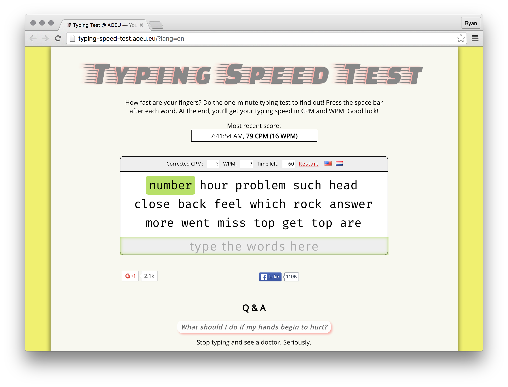

# Typing

**Duration:** About 30 minutes

Being proficient in typing is incredibly important yet often overlooked. Being able to type faster means adding features and fixing bugs faster. The **Typing Speed Test** is a traditional typing test that measures your typing speed of common English words which are often used as variable and function names in web development.

In this lesson, your objective is to demonstrate competency with quickly typing common English words. To complete this objective, please open up the Typing Speed Test in Chrome and complete the self-assessment at the end of this lesson.

[Typing Speed Test][typing_speed_test]

[][typing_speed_test]

[typing_speed_test]: http://typing-speed-test.aoeu.eu/?lang=en

### Self-assessment

Take the test a couple of times and write down your average words per minute for each test. See if you can score faster than 70 words per minute.

### Conclusion

### !challenge

* type: short-answer
* id: 6a57fc90-5a20-4cb7-a1b3-752f74f07ff9
* title: Typing

##### !question
## What's your typing speed?

Enter your typing speed in words per minute.
##### !end-question

##### !answer
/\d+/
##### !end-answer

##### !placeholder
45
##### !end-placeholder

##### !explanation
🎊 Congratulations! 🎉 By completing this exercise, you've demonstrated a high degree of discipline and competency with quickly typing common English words. Continue improving your typing speed by periodically retaking this test.
##### !end-explanation

### !end-challenge
